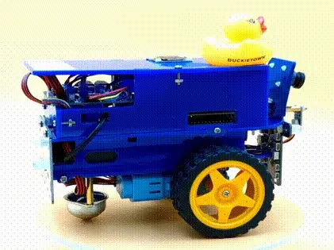

# Learning Experience - Getting started with Duckiebot21

## 1. Introduction

Welcome to your very first Learning Experience!

This LX will guide you through the essential components and incredible capabilities of the DuckieBot21 robot from Duckietown.
The DuckieBot21 is a versatile educational robot that offers a hands-on adventure into robotics, autonomous driving, and artificial intelligence.

The robot comes equipped with an array of amazing sensors, capable actuators, a powerful and smart computing unit, and a robust power system, all of which work together to enable the robot to perform complex tasks such as navigation, obstacle avoidance, and path planning.

### Index

1. [Introduction](README.md)
2. [Sensors](sensors.md)
3. [Actuators](actuators.md)
4. [Computing / Processor](computing.md)
5. [Power](power.md)
