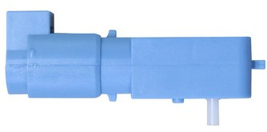

# Learning Experience - Getting started with Duckiebot DB21J

---

## Introduction

Welcome to your very first Learning Experience!

This readme will guide you through the essential components and incredible capabilities of the Duckiebot DB21J robot from Duckietown.
The Duckiebot DB21J is a versatile educational robot that offers a hands-on adventure into robotics, autonomous driving, and artificial intelligence.

The robot comes equipped with an array of amazing sensors, capable actuators, a powerful and smart computing unit, and a robust power system, all of which work together to enable the robot to perform complex tasks such as navigation, obstacle avoidance, and path planning.

---

## Learning Outcomes

The goal of this Learning Experience is to get started and help you understand your Duckiebot DB21J robot.
By the end of this Learning Experience, you will be able to:

1. Understand the breakdown of the Duckiebot DB21J robot into different sections.
2. Understand the purpose and functionality of each section.
3. Be able to identify and locate the different components of the Duckiebot DB21J robot.
4. Understand the basic working principles of these components.
5. Understand how these components work together to enable the robot to perform complex tasks.

---

## Breakdown of Sections

This LX is divided into several sections, each focusing on a different aspect of the Duckiebot DB21J robot to facilatate the better understanding of the purpose and functionality of each section.

1. [Sensors](sensors.md)

    This section covers the various sensors equipped on the robot like cameras, ToF, IMU, wheel encoders, etc.

    

    
    
    
    
    

    
    We will discuss how each sensor contributes to the robot’s ability to perceive and interact with its environment.

2. [Actuators](actuators.md)

    This section covers the different actuators equipped on the robot like motors, LED's and an OLED display.

    

    
    

    
    These actuators are responsible for the robot’s movement and interaction with the environment.

3. [Computing](computing.md)

    This section covers the computing unit equipped on the robot like the Jetson Nano and the Duckiehut.

    

    
    

    
    The computing unit is the brain of the robot and is responsible for processing sensor data, making decisions, executing control algorithms, moving the actuators, etc.

4. [Power](power.md)

    This section covers the power system equipped on the robot like batteries, power management components, etc.

    

    
    

    
    We will discuss the Smart Duckiebattery, its capacity, and how it supports the robot’s energy needs.

---
