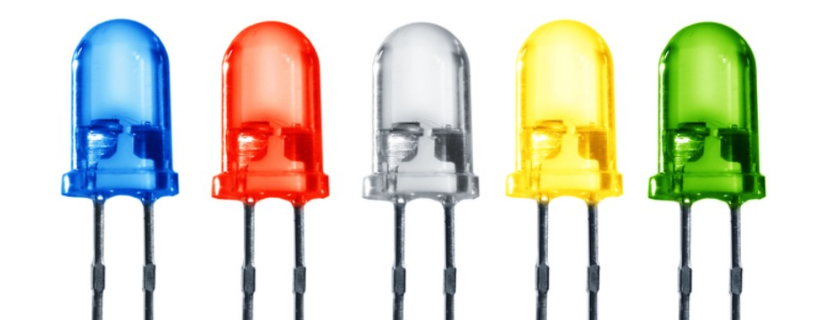

# Actuators

---

[Back to Index](README.md) | [Next: Computing](computing.md)

## Actuators - Introduction

What are actuators?

Actuators are devices that convert electrical signals into physical movement.  
They are the muscles of a robot, enabling it to interact with and manipulate its environment. 

In the context of robotics, actuators are used to create motion, apply force, and perform actions.  
They receive commands from the robot's control system and translate them into mechanical movements or operations.

Let's take a simple example from our real world.  
Imagine that you are turning the steering wheel of a car.  
Your hands act as actuators that move the wheel, controlling the direction of the car.  
In this scenario, your hands are receiving signals from your brain and converting them into the physical action of steering.

Actuators are essential for a robot's functionality, enabling it to perform tasks such as moving, lifting, rotating, gripping and interacting with objects.

Let's proceed to understand the various actuators equipped on the Duckiebot DB21J robot.

---

## Actuators on Duckiebot DB21J

### Motors

#### Description

Motors are devices that convert electrical energy into mechanical motion.  
The Duckiebot DB21J is equipped with DC motors.  
These motors drive the wheels of the robot, allowing it to move forward, backward, and turn.

#### Picture

#### Working Principle

DC motors work by converting direct current electrical energy into rotational mechanical energy through the interaction of magnetic fields. 
When electrical current passes through the motor's coils, it generates a magnetic field. 
This magnetic field interacts with the fixed magnets inside the motor, causing the motor's shaft to rotate. 
By controlling the direction and amount of current, the speed and direction of the motor's rotation can be precisely controlled.

#### Usage Example

Motors are fundamental for the movement and operation of the Duckiebot. They provide the following capabilities:

- Driving the wheels to move the robot in different directions.
- Controlling the speed of the robot by adjusting the power supplied to the motors.
- Executing complex driving patterns such as turning, reversing, and following a trajectory could be achieved by controlling the motors.

---

### RGB LED's

#### Description

RGB LED's are light-emitting diodes that can produce a wide range of colors by combining red, green, and blue light.
The Duckiebot DB21J is equipped with RGB LED's that can be programmed to display different colors and patterns.

#### Picture

#### Working Principle

1. A single channel LED

    A single channel LED is a simple device that emits light when an electrical current passes through it.
    The intensity of the light is controlled by the amount of current flowing through the LED.
    The color of the light emitted by a single channel LED is determined by the material used in the LED's construction.
    Usually, different semiconductor materials are used to produce different colors of light.

2. RGB LED

    RGB LED's are composed of three separate LED's, each emitting a different color of light: red, green, and blue.
    By adjusting the intensity of each color channel, a wide range of colors can be produced (Color Mixing).
    RGB LED's are commonly used in displays, lighting systems, and indicators to create colorful and dynamic visual effects.

    

    
    

3. Creating Colors

    White light can be created by combining the red, green, and blue channels at full intensity.
    Red, Green, and Blue are easy to create by turning on the corresponding channel at full intensity.
    Other colors can be created by mixing the red, green, and blue channels at different intensities.
    For instance, yellow can be created by mixing red and green channels, while cyan can be created by mixing green and blue channels.

    

    
    

#### Usage Example

It's important to understand that these LED's are actuators, because they can be controlled to display different colors and patterns based on the robot's state or behavior.
For example, the RGB LED's on the Duckiebot can be programmed to:

- Indicate various robot's status like depreciating battery, error condition, signal for a user to interact with the robot.
- Display different colors based on the robot's mode of operation (e.g., autonomous mode, manual mode, calibration mode).
- Use different strobing patterns to signal the robot's intention or action (e.g., stopping, turning, following a trajectory).

---

