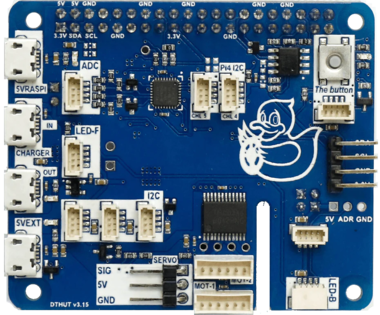

# Computing

---

[Back to Index](README.md) | [Next: Power](power.md)

## Computing - Introduction

What do we mean by computing?

Computing in robotics involves the processing of data, decision-making, and control. 
If we had to compare it a human analogy, computing is like the brain of a robot, responsible for interpreting information, making decisions, and executing actions.

In the context of robotics, computing systems are responsible for:

- Interpreting data from sensors and making decisions based on that data.
- Controlling actuators to perform desired actions.
- Running software that allows the robot to execute tasks autonomously.

Let's proceed to understand the computing components equipped on the Duckiebot DB21J robot.

---

### Jetson Nano

#### Description

The Jetson Nano is a powerful computing module designed by NVIDIA, specifically for AI and robotics applications.
The Duckiebot DB21J is equipped with a Jetson Nano, providing it with the computational power required for advanced tasks.  
The Jetson Nano operates as the central processing unit (CPU) of the Duckiebot, managing all computational tasks. 
With its quad-core ARM CPU and 128-core NVIDIA GPU, the Jetson Nano can handle complex computations, including real-time image processing and machine learning inference.  
It processes data from various sensors, runs algorithms for navigation and control, and executes the software that drives the robot's behavior. 

#### Picture

#### Usage Example

The Jetson Nano enhances the Duckiebot's capabilities by providing robust computational power for various tasks:

- Processing sensor data to understand the environment and make decisions.
- Running machine learning models for tasks such as object detection and path planning.
- Controlling actuators to perform precise movements and interactions.
- Implement real-time navigation and obstacle avoidance.
- Integrate with other systems for comprehensive data processing and decision-making.

---

### Duckiehut

#### Description

TBD by the Duckietown team.

#### Picture

#### Working Principle

TBD by the Duckietown team.

#### Usage Example

The Duckiehut is an essential component of the Duckiebot's computing system, providing the following capabilities:

- Enabling the Duckiebot to process data from multiple sensors simultaneously.
- Supporting the integration of additional computing modules for expanded functionality.
- Ensuring reliable and efficient operation of the Duckiebot's computing system.
- Supporting the Duckiebot's navigation, control, and decision-making processes.

---

[Back to Index](README.md) | [Next: Power](power.md)

---
