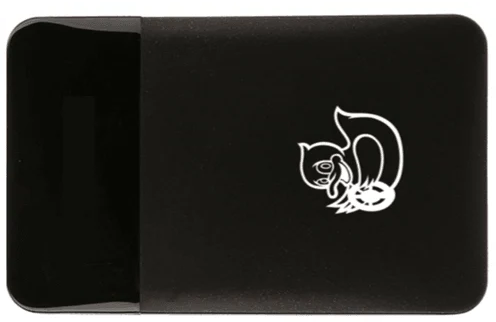

# Power

---

[Back to Index](README.md)

## Power - Introduction

What is power?

Power in robotics refers to the energy source that drives all the electronic and mechanical components of the robot. 
It is the lifeblood of a robot, enabling it to perform tasks, operate sensors, run computing units, and actuate motors.

In the context of robotics, power systems are responsible for:

- Supplying the necessary energy to all components of the robot.
- Ensuring a stable and continuous power supply to maintain smooth operation.
- Managing energy consumption to optimize performance and extend operational time.

Let's proceed to understand the power components equipped on the Duckiebot DB21J robot.

---

### DuckieBattery

#### Description

The DuckieBattery is a custom-designed battery pack that powers the Duckiebot DB21J.
It provides the necessary energy to operate the robot in its entirety, including motors, sensors, computing units, and other components.

#### Picture

#### Working Principle

At the heart of the DuckieBattery is a rechargeable lithium-ion battery pack that stores electrical energy.
The storage capability of the battery stems from the chemical reactions that occur within its cells when charged.
When the Duckiebot is in operation, the battery releases stored energy to power the robot's components, ensuring continuous functionality.
When the battery's energy level depletes, it can be recharged using an external power source, allowing for repeated use.

#### Usage Example

The DuckieBattery is essential for the Duckiebot's operation, providing reliable and consistent power. It enables the following capabilities:

- Powering the motors to drive the robot's movements.
- Supplying energy to the sensors for environmental perception.
- Ensuring stable power supply for consistent performance across all components.
- Facilitating quick recharging to minimize downtime and maintain productivity.

[Back to Index](README.md)

---