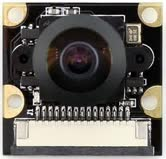

# Sensors

---

[Back to Index](README.md) | [Next: Actuators](actuators.md)

## Sensors - Introduction

What are Sensors? And why do we need them?

Sensors are devices that detect and respond to some type of input from the physical environment.
They convert the physical quantity into an electrical signal that can be read by an observer or by an instrument.

In the context of robotics, sensors are used to perceive the environment and provide feedback to the robot.
They help the robot to understand its surroundings, make decisions, and interact with the environment.

Let's take a simple example from our real world.
Imagine that you are walking in a dark room and you want to find the light switch.
You use your sense of touch to feel the wall and find the switch.
In this example, your sense of touch is acting as a sensor that helps you to perceive the environment and interact with it.

Let's proceed to understand the various sensors equipped on the Duckiebot DB21 robot.

---

## Sensors on Duckiebot DB21

### Camera

#### Description

The Duckiebot DB21 is equipped with a Waveshare Raspberry Pi Camera Module with a fish-eye lens, providing a wide 160-degree field of view. This high-quality camera is crucial for capturing detailed images of the robot's environment, which are then used for various computer vision tasks.

#### Picture

#### Working Principle

1. Gathering Light and focusing it on a Sensor:

    Light from the environment reflects off objects and travels towards the camera. The lens focuses this incoming light to create a sharp image on the sensor plane.

#### Functionality

The camera captures images (frames) of the surrounding environment.
These images are processed by the robot to understand its surroundings and make autonomous decisions.
The camera enables the Duckiebot DB21 to:

- Detect and follow lanes on the road
- Identify and react to traffic signs and obstacles
- Navigate complex environments using simultaneous localization and mapping (SLAM)

#### Usage Example

The continuous stream of images from the camera can be utilized for real-time navigation.
For instance, the Duckiebot DB21 can:

- Use detected lines on the road to maintain a straight path or navigate curves.
- Apply feature detection to recognize specific patterns or objects in its environment.
- Build control points from the visual data to plot a course and adjust its movements accordingly.

