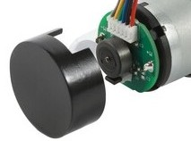

# Sensors

---

[Back to Index](README.md) | [Next: Actuators](actuators.md)

## Sensors - Introduction

What are Sensors? And why do we need them?

Sensors are devices that detect and respond to some type of input from the physical environment.
They convert the physical quantity into an electrical signal that can be read by an observer or by an instrument.

In the context of robotics, sensors are used to perceive the environment and provide feedback to the robot.
They help the robot to understand its surroundings, make decisions, and interact with the environment.

Let's take a simple example from our real world.
Imagine that you are walking in a dark room and you want to find the light switch.
You use your sense of touch to feel the wall and find the switch.
In this example, your sense of touch is acting as a sensor that helps you to perceive the environment and interact with it.

Let's proceed to understand the various sensors equipped on the Duckiebot DB21 robot.

---

## Sensors on Duckiebot DB21

### Camera

#### Description

The Duckiebot DB21 is equipped with a Waveshare Raspberry Pi Camera Module with a fish-eye lens, providing a wide 160-degree field of view.

#### Picture

#### Working Principle

1. Gathering Light and focusing it on a Sensor:

    Light from the environment reflects off objects and travels towards the camera. 
    The lens focuses this incoming light to create a sharp image on the sensor plane.

    

    
    

2. Capturing Light with Photodetectors:

    The digital sensor behind the lens is an array of millions of tiny photodetectors, typically made of CMOS (Complementary Metal-Oxide-Semiconductor) technology. 
    Each photodetector acts like a tiny light meter, converting the captured light into an electrical signal.

3. Converting Light Intensity to Digital Values:
   
   The strength of the electrical signal from each photodetector depends on the amount of light it receives. 
   This translates directly to the brightness level of that specific point in the image. 
   The camera then assigns a digital value to each signal, typically ranging from 0 (black, no light detected) to a maximum value (often 255, white, maximum light detected).
   The color of each pixel is determined by the intensity of the red, green, and blue light detected by the sensor.

4. Assembling the Image:

    The camera arranges the millions of individual pixel values into a grid, creating a digital representation of the scene.

    

    
    

    

#### Usage Example

The camera captures images (frames) of the surrounding environment. 
Each frame is a 2D array of pixel values, representing the brightness and color of each point in the image.
We can process these frames to extract useful information about the environment.
For example, we can obtain the following information from these frames:

- Region of interest to narrow down the search area
- Grouping a cluster of pixels as edges, lines, etc.
- Detecting patterns, shapes, and objects using these clusters

Once we have this information, we can use it to make decisions and control the robot.
For example, we can:

- Detect lane markings on the road to follow a path, curve, or intersection.
- Identify obstacles in the robot's path to avoid collisions.
- Recognize traffic signs and signals to obey traffic rules.
- Track objects of interest for interaction or navigation.

---

### ToF Sensor

#### Description

ToF stands for Time-of-Flight.
The Duckiebot DB21 is equipped with a VL53L1X ToF sensor.
The ToF sensor gives us a depth data oin front of the robot for a diagonal field of view of 27 degrees.

#### Picture

#### Working Principle

A Time-of-Flight (ToF) sensor works by emitting a short burst of infrared light, invisible to the human eye. 

This light pulse travels outwards and bounces off objects in the environment. 

The sensor then measures the time it takes for the light pulse to travel to an object and reflect back. 

Based on the speed of light and the measured time, the sensor calculates the distance to the object.

#### Usage Example

The robot is practically blind for distance measurement given that a Monocular Camera (Single Cam) cannot provide depth information.
This is why we have a ToF sensor which provides depth information about the environment in front of the robot.
This data is usually represented in a floating-point number, indicating the distance in meters from the sensor to the object.
We can use this depth information to:

- Detect obstacles in the robot's path and avoid collisions.
- Measure the distance to objects for navigation and interaction.
- Dock the robot accurately to a charging station or a specific location.
  
---

### IMU

#### Description

IMU stands for Inertial Measurement Unit.
The Duckiebot DB21 is equipped with an MPU-6050 IMU sensor.
The IMU sensor provides us with data on the robot's orientation, acceleration, and angular velocity across three axes.

#### Picture

#### Working Principle

An Inertial Measurement Unit (IMU) sensor combines accelerometers and gyroscopes to measure linear acceleration and angular velocity, respectively. 

Accelerometers detect changes in velocity, providing information about movement in space. 

Gyroscopes measure the rate of rotation around the robot's axes. 

Together, these measurements enable the IMU to determine the robot's orientation, movement, and position relative to its starting point.

#### Usage Example

Since an IMU provides information about the robot's orientation, acceleration, and angular velocity, we can use this data for various purposes, such as:

- Keeping track of the robot's movement and position in real-time, which is crucial for navigation.
- Stabilizing the robot to maintain a steady course or orientation, even on uneven surfaces.
- Assisting with complex maneuvers, such as turning accurately and maintaining balance during sharp movements.
- Perform precise movements, such as rotating to a specific angle or following a predefined trajectory.
- Integrate with other sensors to provide a comprehensive understanding of the robot's environment and actions.
- Detect and compensate for external disturbances, such as vibrations, shocks, or sudden changes in direction.

---

### Encoder

#### Description

Encoders are devices that convert mechanical motion into electrical signals.
The Duckiebot DB21 is equipped with wheel encoders.
These encoders provide data on the rotational position and speed of the robot's wheels, enabling precise measurement of distance traveled.

#### Picture

#### Working Principle

Wheel encoders function by using a rotating disk with a pattern of lines or slots and a sensor that detects these patterns as the disk spins. 

As the wheels of the robot turn, the encoder disk rotates, and the sensor counts the number of lines or slots that pass by. 

Using simple math we can then translate these counts into the wheel's rotational position and speed, allowing the system to calculate the distance traveled and the speed of the robot.

#### Usage Example

Encoders are essential for precise navigation and control of the Duckiebot. They provide the following benefits:

- Measuring the distance the robot has traveled by counting the number of wheel rotations.
- Calculating the speed of the robot, which is crucial for maintaining consistent and controlled motion.
- Enabling accurate control of the robot's movements, such as stopping at a specific point or maintaining a steady speed.

With the encoder data, we can improve the Duckiebot's capabilities in various ways:

- Implementing odometry to track the robot's position over time, which is vital for navigation and path planning.
- Ensuring precise movement and stopping distances, which is important for tasks like docking and obstacle avoidance.
- Integrating with other sensors to provide comprehensive data for more advanced control algorithms.

---

